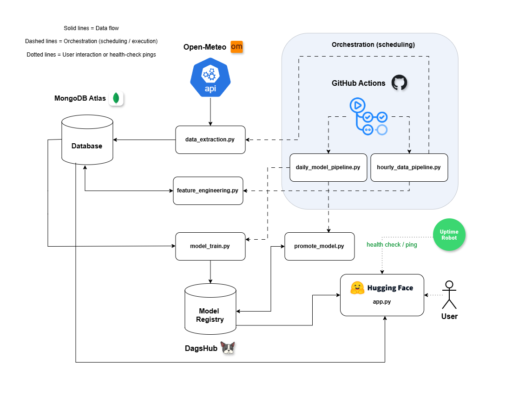

# 🧭 Pearls AQI Predictor: End-to-End MLOps for Air Quality Forecasting

 

[](https://deepwiki.com/ShehrazSarwar/pearls-aqi-predictor)
[](https://github.com/ShehrazSarwar/pearls-aqi-predictor/blob/main/Project%20Report.pdf)

## 🌐 Live App

The Streamlit dashboard is deployed on Hugging Face Spaces and serves real-time AQI insights and 3-day forecasts.

[](https://shehrazsarwar-pearls-aqi-predictor.hf.space) 

### 🛰️ Availability Monitoring

To keep a serverless deployment responsive, the app receives scheduled heartbeat checks from UptimeRobot every 5 minutes.

## 📘 Project Overview

This repository implements a production-style MLOps system for forecasting PM2.5 concentration in Karachi, Pakistan across three horizons: 24h, 48h, and 72h.

Core stack:

1. GitHub Actions for hourly and daily orchestration
2. MongoDB Atlas for raw and engineered data storage
3. DagsHub MLflow for experiment tracking and model registry
4. Streamlit for interactive forecast reporting

The objective is not only forecasting, but continuous model improvement through automated retraining and champion promotion.

## 🧩 Key Capabilities

1. 🗄️ Hourly data ingestion from Open-Meteo weather and air-quality endpoints
2. 🧪 Feature engineering with lags, rolling stats, cyclical features, and interaction signals
3. 🧠 Daily multi-model training (XGBoost, LightGBM, Random Forest)
4. 🏆 Automatic winner selection using validation metrics
5. 📦 Versioned registration in MLflow Model Registry
6. 🔁 Champion-vs-challenger promotion flow
7. 📡 Streamlit dashboard with forecast tables, trend charts, and health guidance

## 🧭 Architecture



## 🛠️ Pipeline Workflow

### 1. Hourly Data Pipeline (`hourly_data.yml`)

Runs every hour to keep data fresh.

1. `scripts/data_extraction.py`
   Fetches recent meteorological and pollutant values from Open-Meteo and writes incremental records into `raw_data`.

2. `scripts/feature_engineering.py`
   Builds model-ready features and target horizons (`target_h24`, `target_h48`, `target_h72`) and syncs them to `feature_store`.

### 2. Daily Model Pipeline (`daily_model.yml`)

Runs daily to retrain and refresh production quality.

1. `scripts/model_train.py`
   Loads engineered data, trains candidate models, compares metrics, logs experiments to MLflow, and registers the winning model as a new version.

2. `scripts/promote_model.py`
   Compares latest version with current champion and updates alias when performance or freshness rules are met.

## 📁 Repository Layout

```text
.
pearls-aqi-predictor/
├── .github/workflows/
│   ├── hourly_data.yml
│   └── daily_model.yml
├── app/
│   └── app.py
├── automation_scripts/
│   ├── hourly_data_pipeline.py
│   └── daily_model_pipeline.py
├── scripts/
│   ├── data_extraction.py
│   ├── feature_engineering.py
│   ├── model_train.py
│   └── promote_model.py
├── notebooks/
├── test_notebooks/
├── test_scripts/
├── models/
├── requirements.txt
├── requirements-ci.txt
└── README.md
```

## 🧰 Prerequisites

1. Python 3.10+
2. MongoDB Atlas account
3. DagsHub account
4. Git installed locally

## ⤴️ Installation

1. Clone repository

```bash
git clone https://github.com/ShehrazSarwar/pearls-aqi-predictor.git
cd pearls-aqi-predictor
```

2. Install dependencies

```bash
pip install -r requirements.txt
pip install -r requirements-ci.txt
```

## 🗄️ Complete MongoDB Atlas Setup

### 1. Create Atlas Cluster

1. Sign in to MongoDB Atlas
2. Create a new project (example: `aqi-predictor`)
3. Create an M0 free cluster (or higher tier)
4. Choose cloud provider/region closest to deployment

### 2. Create Database User

1. Go to `Security` -> `Database Access`
2. Add user with username/password
3. Grant `Read and write to any database` (or scoped permissions if preferred)

### 3. Configure Network Access

1. Go to `Security` -> `Network Access`
2. Add current IP, or `0.0.0.0/0` for development/testing
3. Save allowlist rule

### 4. Get Connection String

1. Open cluster -> `Connect` -> `Drivers`
2. Copy URI in this format:

```text
mongodb+srv://<username>:<password>@<cluster-url>/?retryWrites=true&w=majority
```

### 5. Database and Collections Used by This Project

1. Database: `aqi_predictor` (default if not overridden)
2. Collections:
   1. `raw_data`
   2. `feature_store`

No manual collection creation is required; scripts create them automatically on first write.

## 🧠 Complete DagsHub + MLflow Setup

### 1. Create DagsHub Account and Repository

1. Sign in at DagsHub
2. Create repository (or link existing GitHub repo)

### 2. Generate Access Token

1. Go to profile settings -> tokens
2. Create a token with repository/MLflow access
3. Copy token securely

### 3. Identify MLflow Tracking URI

Use the repository MLflow endpoint, commonly:

```text
https://dagshub.com/<username>/<repo-name>.mlflow
```

### 4. Set Environment Variables

Create `.env` in project root:

```env
# MongoDB
MONGO_URI="mongodb+srv://<username>:<password>@<cluster-url>/?retryWrites=true&w=majority"
DB_NAME="aqi_predictor"

# MLflow via DagsHub
MLFLOW_TRACKING_USERNAME="<dagshub_username>"
MLFLOW_TRACKING_PASSWORD="<dagshub_access_token>"
MLFLOW_TRACKING_URI="https://dagshub.com/<dagshub_username>/<repo-name>.mlflow"

# Optional: if you want a custom feature collection name for training script
COLLECTION_NAME="feature_store"
```

### 5. Verify DagsHub Connectivity (Optional Quick Test)

```bash
python -c "import os, mlflow; from dotenv import load_dotenv; load_dotenv(); mlflow.set_tracking_uri(os.getenv('MLFLOW_TRACKING_URI')); print('Tracking URI:', mlflow.get_tracking_uri())"
```

## ✨ Running the Project

### A. Run Data Pipeline

```bash
python automation_scripts/hourly_data_pipeline.py
```

### B. Run Model Pipeline

```bash
python automation_scripts/daily_model_pipeline.py
```

### C. Run Streamlit App

```bash
streamlit run app/app.py
```

## 📐 What You Get in the Dashboard

1. 🗺️ Current AQI status and category
2. 🔭 24h, 48h, 72h forecast outputs
3. 📡 Interactive trend visualizations
4. 🩺 Health guidance per forecast day
5. 💾 Downloadable 7-day report CSV

## 🎉 Current Status

The project is operational with automated ingestion, training, registry updates, and dashboard delivery.

## 🧾 Author

Built by **Shehryar Naveed**.

## 🤝 Acknowledgements

1. Open-Meteo API for weather and air quality data
2. MongoDB Atlas for managed data infrastructure
3. DagsHub + MLflow for experiment tracking and model lifecycle
4. Streamlit for rapid data application delivery

---

⭐ If this project helps you, consider starring the repository and sharing it.
